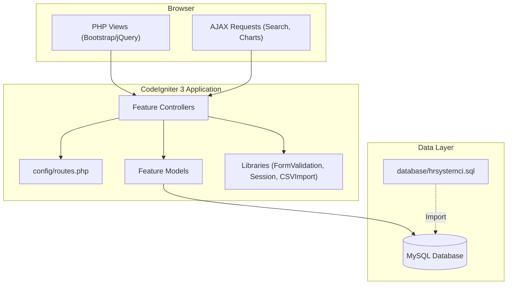
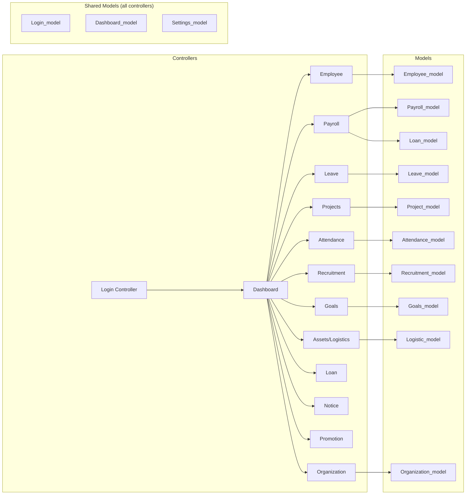

# HR Management System (HRMS)

A full-featured, web-based Human Resource Management System built on CodeIgniter 3 (PHP/MySQL). Designed for organizations that need a centralized platform to manage their entire employee lifecycle — from onboarding and attendance to payroll, recruitment, performance goals, and asset management — with a role-based access system and a rich analytics dashboard.

## Features

### Core Functionality
- **Employee Management**: Full CRUD for employee records including personal info, address, education, work experience, bank accounts, documents, and social media profiles with tabbed profile views and photo upload
- **Role-Based Access Control**: Three distinct roles — **Admin**, **HR-Manager**, and **Employee** — each with a unique sidebar navigation and permissions scope. Admins have full system access, HR-Managers handle day-to-day HR operations, and Employees have a self-service portal
- **Authentication System**: Secure session-based login with redirect guards on every controller method to prevent unauthorized access
- **Personalized Dashboard**: A dynamic welcome panel showing the logged-in user's avatar, designation, and joining date alongside live metric cards (Active Employees, Approved Leaves, Running Projects, Total Payslips)
- **Global Search Bar**: AJAX-powered live search across employees — searches by name, employee ID, email, department, and job title in real time with a dropdown result panel and color-coded status indicators

### Employee & Organization
- **Employee Directory**: Searchable and filterable list of all employees with quick-access profile links
- **Employee Profile**: Rich tabbed profile page covering Personal Info, Address, Education, Experience, Bank Account, Documents, Salary, Social Media, and Change Password — all editable in-place
- **Department & Designation Management**: Create and manage organizational units; designations are linked to employees and drive chart visualizations
- **Disciplinary Records**: Track and manage disciplinary actions per employee
- **Inactive Employee Management**: Separate view for terminated/inactive accounts for audit purposes
- **Promotion Management**: Log and review promotion history for employees with a dedicated promotion list view

### Attendance
- **Attendance List**: View all attendance records with employee-linked lookups
- **Add Attendance**: Manually log attendance entries per employee, with support for editing existing records
- **CSV Import**: Bulk-import attendance records from a CSV file using the `csvimport` library
- **Attendance Report**: Per-employee attendance report with date range filtering
- **Analytics Chart**: Interactive monthly attendance chart on the Analytics page with month and year selectors, rendering a bar/line chart via Chart.js

### Leave Management
- **Holiday Calendar**: Manage company-wide holidays with a visual calendar interface
- **Leave Types**: Configure different categories of leave (sick, annual, unpaid, etc.)
- **Leave Application**: Employees submit leave requests; HR-Managers/Admins review and approve or reject with a dedicated approval queue
- **Earned Leave**: Track leave entitlements and balances per employee
- **Leave Sheet**: Employees view their personal leave history and remaining balances
- **Leave Report**: Aggregated leave statistics for reporting

### Payroll
- **Salary Types**: Configure salary components (basic, allowances, deductions)
- **Payroll List**: View all generated salary records with employee and period filters
- **Generate Payslip**: Create payslips for individual employees for a given pay period, incorporating salary types, deductions, and loan installment deductions
- **Payslip Report**: Print-ready payslip view accessible to both admins and employees
- **Salary View**: Detailed breakdown of a single payslip including all earning and deduction components
- **Invoice Generation**: Generate payment invoices linked to salary records

### Recruitment
- **Job Postings**: Admins and HR-Managers publish open job positions with details such as designation, department, description, and deadline
- **Job Details Page**: System-internal view of a specific job posting
- **Applications List**: Review all received job applications in a consolidated list
- **Application Details**: Drill-down view for each applicant with submitted information and status update controls
- **Dashboard Integration**: Latest job postings are surfaced directly on the main dashboard for quick visibility

### Projects & Tasks
- **All Projects**: Overview of all projects with status tracking (`running`, `completed`, etc.); Employees only see projects they are assigned to
- **Project View**: Detailed project page with task board, team members, milestones, and progress tracking
- **Task List**: Global task list with assignment, due date, priority, and status columns
- **Tasks View**: Kanban-style task management within a project with drag-and-drop support
- **Field Visits**: Log and manage field visit applications linked to employees and projects

### Assets & Logistics
- **Asset List**: Inventory of company assets with category, quantity, and assignment tracking
- **Asset Categories**: Define and manage asset types/categories
- **Logistic Support**: Link assets and tasks to project logistics, track support requests, and manage assignments to employees and projects

### Goals & Performance
- **Goals List**: Create, assign, and track performance goals with subject, description, target achievement value, start/end date, and status
- **Goal Types**: Define goal categories (e.g., Sales, Development, Training) that are used to classify goals
- **Goal Details**: Drill-down view per goal showing progress and linked employee

### Notices & Announcements
- **Notice Board**: Post and view company-wide notices; accessible to all roles from the sidebar

### Analytics Dashboard
- **Employee Attendance Chart**: Interactive bar chart showing daily attendance counts for a selected month and year
- **Monthly Attendance Report**: Year-over-year attendance heatmap/line chart across all 12 months
- **Department Distribution Chart**: Doughnut/bar chart showing headcount per department, powered by a JSON API endpoint (`/dashboard/getDepartmentChartData`)
- **Designation Distribution Chart**: Headcount breakdown per job title via `/dashboard/getDesignationChartData`
- **Metric Summary Cards**: Admin dashboard shows live counts for Former Employees (inactive), Pending Leave Applications, and other key HR KPIs

### Global Search
- **Multi-Field Search**: Queries employee `first_name`, `last_name`, `em_code` (ID), `em_email`, `des_name` (designation), and `dep_name` (department) in a single AJAX request
- **Live Dropdown Results**: Results appear after 2 characters with a 300ms debounce; capped at 10 results for performance
- **Status Indicators**: Color-coded dots — Green (Active), Orange (On Leave), Grey (Inactive/Terminated)
- **Result Cards**: Each result shows Employee Name, ID, Job Title, Department, Status, and a direct link to the employee profile
- **Security**: Session-validated endpoint with CodeIgniter's `escape_like_str()` to prevent SQL injection; returns safe JSON

### Loans
- **Loan Management**: Grant loans to employees with amount, interest, and tenure details
- **Loan Installments**: Track repayment schedules with installment-by-installment status; deductions are auto-applied during payslip generation

### Settings
- **System Settings**: Manage global application configuration (company name, logo, etc.)

### Privacy & Compliance
- **Privacy Policy Page**: Dedicated privacy policy view accessible from the system

## Tech Stack

### Backend
- **PHP** (>=5.3.7) with **CodeIgniter 3** MVC framework
- **MySQL / MySQLi** database driver via CodeIgniter's Query Builder (Active Record)
- **CodeIgniter Session** library for authentication state management
- **CodeIgniter Form Validation** library for server-side input validation with XSS clean
- **CodeIgniter csvimport** third-party library for bulk attendance import

### Frontend
- **PHP views** rendered server-side with embedded PHP tags
- **Bootstrap 4** for responsive grid layout and UI components
- **Material Design Icons (MDI)** and **Themify Icons** for the sidebar and UI iconography
- **Font Awesome** for dashboard and profile icons
- **Chart.js** for all analytics charts (attendance bar chart, monthly heatmap, department/designation doughnut charts)
- **jQuery** for AJAX calls (global search, chart data fetching, dynamic UI interactions)
- **Custom SCSS/CSS** compiled into `assets/css/` for theme overrides and component styling

### Database
- **MySQL** relational database (`hrsystemci`)
- Schema managed via exported SQL file (`database/hrsystemci.sql`)
- Key tables: `employee`, `designation`, `department`, `emp_leave`, `emp_leave_type`, `attendance`, `project`, `project_task`, `pay_salary`, `salary_type`, `loan`, `loan_installment`, `assets`, `goals`, `goal_types`, `notice`, `recruitment_jobs`, `recruitment_applications`, `logistic_support`, `promotion`

### Server
- **Apache** with `.htaccess` URL rewriting for clean CodeIgniter URLs
- **PHP** hosted via XAMPP / WAMP / any standard LAMP stack
- Timezone set to `Asia/Manila` (configurable per controller)

## System Architecture

The system follows CodeIgniter's classic **MVC** pattern with a role-aware view layer and shared models across feature controllers.



## Module Dependency



## Project Structure

```
HRMS-feature-dashboard-enhancements/
├── application/
│   ├── config/                  # CodeIgniter configuration
│   │   ├── config.php           # Base URL, encryption key, session settings
│   │   ├── database.php         # MySQL connection settings
│   │   ├── routes.php           # URL routing rules
│   │   └── autoload.php         # Auto-loaded libraries and helpers
│   ├── controllers/             # Feature controllers (one per module)
│   │   ├── Dashboard.php        # Main dashboard, analytics chart API endpoints
│   │   ├── Employee.php         # Employee CRUD, global search API
│   │   ├── Payroll.php          # Salary types, payslip generation, reports
│   │   ├── Leave.php            # Holidays, leave types, applications, approvals
│   │   ├── Attendance.php       # Attendance list, add, report, CSV import
│   │   ├── Projects.php         # Projects, tasks, field visits
│   │   ├── Recruitment.php      # Job postings, applications, status updates
│   │   ├── Goals.php            # Goal types, goals CRUD
│   │   ├── Logistice.php        # Asset list, categories, logistic support
│   │   ├── Loan.php             # Loan granting, installment tracking
│   │   ├── Notice.php           # Company notices
│   │   ├── Promotion.php        # Promotion records
│   │   ├── Organization.php     # Departments, designations
│   │   ├── Settings.php         # Global system settings
│   │   └── Login.php            # Authentication (login/logout)
│   ├── models/                  # Database interaction layer
│   │   ├── Employee_model.php   # Employee queries, designation/department lookups
│   │   ├── Payroll_model.php    # Salary, payslip, salary-type queries
│   │   ├── Leave_model.php      # Leave, holiday, earned-leave queries
│   │   ├── Attendance_model.php # Attendance CRUD and reporting queries
│   │   ├── Project_model.php    # Project, task, asset, field-visit queries
│   │   ├── Recruitment_model.php# Job postings, applications queries
│   │   ├── Goals_model.php      # Goals and goal-types queries
│   │   ├── Logistic_model.php   # Asset and logistic support queries
│   │   ├── Loan_model.php       # Loan and installment queries
│   │   ├── Organization_model.php # Dept/designation with employee count (for charts)
│   │   ├── Dashboard_model.php  # To-do list, summary queries
│   │   ├── Notice_model.php     # Notice board queries
│   │   ├── Promotion_model.php  # Promotion history queries
│   │   └── Login_model.php      # Authentication queries
│   ├── views/
│   │   ├── login.php            # Login page
│   │   └── backend/             # All authenticated views (51 files)
│   │       ├── header.php       # Top navbar with global search bar and AJAX logic
│   │       ├── sidebar.php      # Role-aware sidebar navigation (Admin / HR-Manager / Employee)
│   │       ├── footer.php       # Scripts, Chart.js initialization
│   │       ├── dashboard.php    # Main dashboard with KPI cards, charts, to-do, job feed
│   │       ├── analytics_view.php # Standalone analytics page (attendance & org charts)
│   │       ├── employee_view.php  # Full employee profile with tabbed editor
│   │       ├── employees.php      # Employee directory list
│   │       ├── add-employee.php   # New employee registration form
│   │       ├── salary_list.php    # Payroll list
│   │       ├── salary_view.php    # Single payslip detail view
│   │       ├── projects_view.php  # Project detail with tasks and team
│   │       ├── tasks_view.php     # Kanban-style task board
│   │       ├── jobs_list.php      # Job postings board
│   │       ├── applications_list.php # Recruitment applications
│   │       ├── goals_list.php     # Goals management
│   │       └── ...               # Additional feature views
│   ├── libraries/               # Third-party libraries (csvimport, etc.)
│   ├── helpers/                 # Custom CodeIgniter helpers
│   └── hooks/                   # CodeIgniter hooks
├── assets/
│   ├── css/                     # Compiled stylesheets and theme CSS
│   ├── js/                      # Custom JavaScript files
│   ├── scss/                    # SCSS source files
│   ├── images/                  # User avatars, logos, and static images
│   ├── plugins/                 # Frontend plugins (Bootstrap, Chart.js, MDI, etc.)
│   └── export/                  # Generated export files
├── database/
│   └── hrsystemci.sql           # Full MySQL schema and seed data
├── system/                      # CodeIgniter 3 core framework (unmodified)
├── index.php                    # Front controller (CodeIgniter entry point)
├── homepage.php                 # Public landing page
├── .htaccess                    # Apache URL rewriting rules
├── composer.json                # PHP dependency manifest (PHP >=5.3.7)
├── SEARCH_BAR_IMPLEMENTATION.md # Developer guide for the global search feature
└── README.md
```

## API Endpoints Overview

The backend exposes several JSON endpoints consumed internally by AJAX requests on the frontend:

| Endpoint | Method | Description |
|---|---|---|
| `/employee/global_search?search=<term>` | GET | Multi-field employee search; returns JSON array (max 10 results) |
| `/dashboard/getDepartmentChartData` | GET | Returns departments with employee headcount for Chart.js |
| `/dashboard/getDesignationChartData` | GET | Returns designations with employee headcount for Chart.js |
| `/attendance/get_monthly_data` | GET | Returns monthly attendance aggregates for the analytics chart |
| `/dashboard/add_todo` | POST | Adds a to-do item to the dashboard to-do list |
| `/dashboard/Update_Todo` | POST | Marks a to-do item as complete/incomplete |
| `/employee/Update` | POST | Saves employee profile edits |
| `/payroll/Add_Sallary_Type` | POST | Creates or updates a salary type |
| `/recruitment/submit_application` | POST | Submits a new job application |
| `/goals/add_goal` | POST (AJAX) | Creates a new performance goal; returns JSON success/error |

## Role-Based Navigation

| Feature | Admin | HR-Manager | Employee |
|---|:---:|:---:|:---:|
| Organization (Dept/Designation) | Yes | Yes | No |
| Employee Directory & Disciplinary | Yes | Yes | No |
| Inactive Employees | Yes | No | No |
| Attendance (Add/Report) | Yes | Yes | No |
| Leave (Types/Applications/Approvals) | Yes | Yes | Self-service |
| Projects (All) | Yes | Yes | Own projects only |
| Task List | Yes | Yes | Own tasks only |
| Field Visits | Yes | Yes | No |
| Payroll (Generate/List) | Yes | Yes | Payslip only |
| Salary Types | Yes | No | No |
| Recruitment (Postings/Applications) | Yes | Yes | View postings |
| Assets & Logistics | Yes | No | No |
| Loans | Yes | Yes | No |
| Goals | Yes | Yes | No |
| Notice Board | Yes | Yes | Yes |
| Promotion | Yes | Yes | No |
| Analytics | Yes | Yes | No |
| Settings | Yes | Yes | No |

## Features in Detail

### Global Search Bar
The header search field provides a live employee lookup powered by a debounced AJAX call to `GET /employee/global_search`. Each keystroke (after a 2-character minimum and 300ms debounce) fires a CodeIgniter Query Builder query that JOINs `employee`, `designation`, and `department` tables across six searchable fields. Results are rendered as a floating dropdown beneath the input, with a color-coded status indicator dot (green for ACTIVE, orange for ON LEAVE, grey for INACTIVE/TERMINATED) and a direct link to the employee's profile page. The endpoint uses `escape_like_str()` for safe LIKE queries and session validation to block unauthenticated access.

### Analytics Dashboard
The Analytics page (`/dashboard/analytics_view`) renders four Chart.js visualizations:
- **Daily Attendance Chart**: A bar chart filtered by month and year selectors, showing present/absent counts per calendar day.
- **Monthly Attendance Report**: A 12-month line/bar chart for year-over-year attendance trend analysis.
- **Department Distribution**: A doughnut chart populated by the JSON API at `/dashboard/getDepartmentChartData`, showing employee headcount per department.
- **Designation Distribution**: A bar chart powered by `/dashboard/getDesignationChartData` showing headcount per job title.

All charts fetch their data asynchronously and gracefully display a "No data available" placeholder when the underlying dataset is empty.

### Employee Profile
The employee profile view (`/employee/view?I=<base64_id>`) is a single-page tabbed interface with nine tabs: Personal Info, Address, Education, Experience, Bank Account, Document, Salary, Social Media, and Change Password. Each tab renders an editable form that posts to the corresponding update endpoint. The profile card displays the employee's photo, full name, designation, email, phone, and social links (Facebook, Twitter, LinkedIn, Google). If no custom photo is uploaded, a default avatar is shown.

### Payroll & Loan Integration
The payroll generation process pulls salary type configurations (basic pay, allowances, custom deductions) and automatically factors in outstanding loan installments for the pay period. The resulting payslip is stored in `pay_salary` and can be previewed and printed from the Payslip Report view. Each payslip entry is linked to both the employee record and the salary type structure, ensuring a full audit trail for every pay run.

### Recruitment Pipeline
Job postings are created with a designation, department, description, vacancy count, and closing date. Applicants submit via an application form linked to the specific job. HR-Managers and Admins review applications in the Applications List, drill into individual Application Details, and update status (Shortlisted, Interview, Hired, Rejected) with a single action. The latest open postings are automatically surfaced on the main dashboard via `recruitment_model->get_latest_job_postings()`.

### CSV Attendance Import
The `Attendance` controller loads the `csvimport` third-party library, allowing bulk attendance records to be uploaded via a CSV file. The imported rows are parsed and inserted into the `attendance` table in a single operation, making it practical for organizations that track time via external systems or biometric devices that export CSV.

## Setup & Installation

### Prerequisites
- PHP >= 5.3.7 (PHP 7.x recommended for performance)
- MySQL 5.6+ or MariaDB
- Apache with `mod_rewrite` enabled
- XAMPP / WAMP or any standard LAMP stack

### Installation Steps

1. **Clone the repository**
   ```bash
   git clone <repo-url>
   cd HRMS-feature-dashboard-enhancements
   ```

2. **Import the database**
   ```sql
   CREATE DATABASE hrsystemci;
   USE hrsystemci;
   SOURCE database/hrsystemci.sql;
   ```

3. **Configure the database connection**
   Edit `application/config/database.php`:
   ```php
   $db['default'] = array(
       'hostname' => 'localhost',
       'username' => 'your_db_user',
       'password' => 'your_db_password',
       'database' => 'hrsystemci',
       'dbdriver' => 'mysqli',
   );
   ```

4. **Set the base URL**
   Edit `application/config/config.php`:
   ```php
   $config['base_url'] = 'http://localhost/HRMS-feature-dashboard-enhancements/';
   ```

5. **Configure Apache**
   Ensure `.htaccess` URL rewriting is active. The included `.htaccess` removes `index.php` from all URLs.

6. **Set folder permissions**
   ```bash
   chmod -R 755 application/cache/
   chmod -R 755 application/logs/
   chmod -R 755 assets/images/users/
   ```

7. **Access the application**
   Navigate to your configured base URL. Default admin credentials are included in the SQL seed file.

## Security Features

- **Session Guards**: Every controller method checks `session->userdata('user_login_access')` before serving content, redirecting unauthenticated users to the login page
- **XSS Cleaning**: All form inputs are passed through `xss_clean` via CodeIgniter's form validation rules
- **SQL Injection Prevention**: All database queries use CodeIgniter's Query Builder with parameterized bindings and `escape_like_str()` for LIKE clauses
- **CSRF Protection**: CodeIgniter's built-in CSRF token support can be enabled in `config.php`
- **Input Validation**: Server-side validation rules (required, min/max length, XSS clean) enforced on all POST endpoints via `CI_Form_validation`
- **Base64 ID Obfuscation**: Employee profile URLs use `base64_encode($id)` to obscure raw database IDs from the address bar
